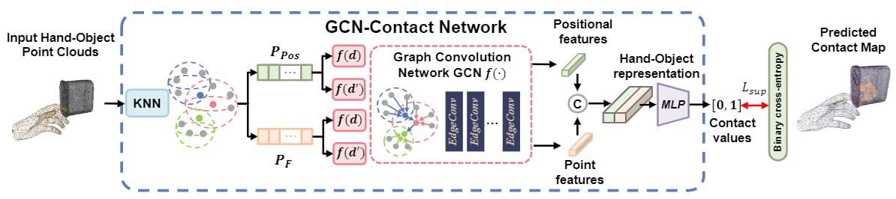

# S<sup>2</sup>Contact: Graph-based Network for 3D Hand-Object Contact Estimation with Semi-Supervised Learning

This repo contains details for our paper: "S<sup>2</sup>Contact: Graph-based Network for 3D Hand-Object Contact Estimation with Semi-Supervised Learning" (ECCV 2022) 

[]()

[[Project Page](https://eldentse.github.io/s2contact/)]




## Installation
This document contains detailed instructions for installing the necessary dependencied for **S<sup>2</sup>Contact**.

- Create and activate a conda environment 
    ```bash
    conda create -n s2contact python=3.8
    conda activate s2contact
    ```  
- Install PyTorch and PyTorch3D
    ```bash
    conda install -c pytorch pytorch=1.7.1 torchvision cudatoolkit=10.2
    conda install -c fvcore -c iopath -c conda-forge fvcore iopath
    conda install pytorch3d -c pytorch3d
    ```  
- Install PyTorch-Geometric
    Please following this [installation instructions](https://pytorch-geometric.readthedocs.io/en/latest/notes/installation.html)

- Install Other dependencies
    ```bash
    pip install git+https://github.com/hassony2/manopth.git open3d tensorboardX pyquaternion trimesh transforms3d chumpy opencv-python
    ```  
- Download MANO Model
    Download the MANO model files (mano_v1_2.zip) from [MANO website](http://mano.is.tue.mpg.de/).
    ```bash
    mano/webuser/lbs.py
    mano/models/MANO_RIGHT.pkl
    ``` 

## Quick Start

- Quick Demo
    ```bash
    python network/run_contactopt.py --split=demo --model=dgcnn
    python network/run_eval.py --split=demo --model=dgcnn
    python network/run_eval.py --split=demo --model=dgcnn --vis
    ```

## TODO
- [ ] To release pseudo labeled dataset.
- [ ] Upload paper to arXiv.

## Acknowledgement
This repo is built upon [ContactOpt](https://github.com/facebookresearch/ContactOpt). We would like to thank their authors for providing great frameworks and toolkits.

## Contact
* Zhongqun Zhang (email:zxz064@student.bham.ac.uk)
* Tze Ho Elden Tse (email:txt994@student.bham.ac.uk)

    Feel free to contact me if you have additional questions. 

